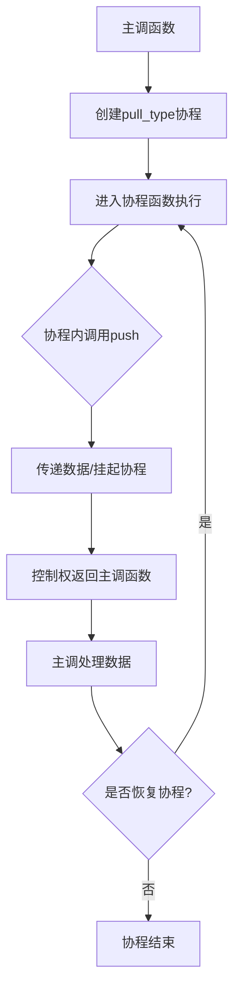

C++ Boost库主要通过`Boost.Coroutine2`（推荐使用）和`Boost.Asio`的协程组件来实现协程功能。下面我们深入探讨其核心原理、分类、实现机制及关键组件。

# 🔄 C++ Boost库协程原理详解

## 1 协程的基本概念

协程（Coroutine）是函数的泛化，允许函数在执行过程中多次挂起和恢复，从而保留执行状态。与普通函数单一入口和单一出口不同，协程可以在特定地点暂停执行，并在之后从暂停点恢复。

**协程与线程的核心区别**：
- **调度方式**：线程由操作系统内核抢占式调度，而协程由程序员在用户态协作式调度。
- **切换开销**：线程切换需要进入内核态，保存大量寄存器状态，开销较大（微秒级）；协程切换完全在用户态进行，只需保存少量上下文，开销极小（纳秒级）。
- **资源占用**：每个线程有独立的栈空间（通常几MB），而协程栈大小可自定义，资源占用更少。

## 2 协程的分类

Boost库主要支持两种维度的协程分类：

### 2.1 有栈协程 vs 无栈协程

| 特性 | 有栈协程 (Stackful Coroutines) | 无栈协程 (Stackless Coroutines) |
|------|-------------------------------|--------------------------------|
| **栈管理** | 每个协程有独立的栈空间 | 共享调用者的栈 |
| **挂起能力** | 可在嵌套函数中任意深度挂起 | 只能在顶层协程函数挂起 |
| **内存开销** | 需要预分配固定大小的栈空间 | 仅需保存程序计数器，开销极小 |
| **灵活性** | 高，可调用任意嵌套函数 | 受限，只能操作顶层变量 |

Boost.Coroutine2实现的是**有栈协程**，而Boost.Asio提供的是**无栈协程**实现。

### 2.2 对称协程 vs 非对称协程

- **非对称协程（Asymmetric Coroutine）**：知道其调用者，挂起时总是将控制权返回给调用者。Boost.Coroutine2主要实现此类协程，使用`push_type`/`pull_type`协作。

- **对称协程（Symmetric Coroutine）**：所有协程地位平等，一个协程可以将控制权直接传递给任何其他协程。Boost.Coroutine（已弃用）曾支持此模式。

## 3 Boost.Coroutine2 的核心原理

### 3.1 上下文切换机制

有栈协程的核心是上下文切换，即保存当前执行状态（寄存器、栈指针等）并恢复另一个协程的状态。Boost使用`boost::context`库实现高效的上下文切换。

每个协程拥有：
- **独立的栈空间**：用于存储函数调用栈和局部变量
- **控制块（Control Block）**：保存寄存器状态（如RIP、RSP、RBP等）

当协程挂起时，当前寄存器状态保存到控制块，然后从目标协程的控制块恢复其状态。

### 3.2 非对称协程的协作模型

Boost.Coroutine2通过`pull_type`和`push_type`模板类实现生产者-消费者模式的协作：

```cpp
// 生产者协程示例
void producer(boost::coroutines2::coroutine<int>::push_type& sink) {
    for (int i = 0; i < 10; ++i) {
        sink(i); // 产生数据并挂起，返回调用者
    }
}

// 消费者上下文
int main() {
    boost::coroutines2::coroutine<int>::pull_type source(producer);
    while (source) {
        std::cout << source.get() << std::endl; // 获取生产者产生的值
        source(); // 恢复生产者协程
    }
}
```

**控制流过程**：
1. 创建`pull_type`时，立即进入协程函数执行
2. 协程调用`sink(value)`时，将值传递给调用者并挂起
3. 调用者通过`source()`恢复协程执行
4. 重复此过程直到协程函数返回

下面是Boost非对称协程的控制流示意图：



### 3.3 模板参数与数据传递

`coroutine<T>`的模板参数`T`指定了协程间传递的数据类型：
- `T`为`void`时，仅传递控制权，不传递数据
- `T`为具体类型时，可通过`get()`/`operator()`方法传递数据

## 4 Boost.Asio 的无栈协程

Boost.Asio提供了基于宏的无栈协程实现，主要面向异步I/O操作，通过`boost::asio::coroutine`类和一系列伪关键字实现。

### 4.1 核心伪关键字

- **`reenter`**：定义协程体，用于重新进入挂起的协程
- **`yield`**：挂起协程，下次进入时从下一语句继续执行
- **`fork`**：复制协程状态，用于并发操作
- **`yield break`**：终止协程执行

### 4.2 无栈协程的实现原理

无栈协程使用局部变量和状态机来跟踪执行位置：

```cpp
#include <boost/asio/coroutine.hpp>
#include <boost/asio/yield.hpp>

boost::asio::coroutine coro;

void async_echo(boost::asio::ip::tcp::socket& socket) {
    reenter(coro) {
        for(;;) {
            yield socket.async_read_some(..., *this); // 挂起，异步读
            yield socket.async_write_some(..., *this); // 挂起，异步写
        }
    }
}
```

编译器会将此类代码转换为状态机，每次进入时根据状态跳转到正确位置。

## 5 协程的销毁与异常处理

### 5.1 协程的销毁过程

当协程函数返回或遇到未捕获异常时，协程进入结束流程：
1. 协程栈展开（unwind），销毁局部变量
2. 协程控制块标记为已完成
3. 关联的`pull_type`/`push_type`对象变为无效

### 5.2 异常处理注意事项

在协程内捕获异常时需要特别小心：

```cpp
try {
    // 协程代码
} catch(const boost::coroutines::detail::forced_unwind&) {
    // 必须重新抛出，确保栈展开正确
    throw;
} catch(...) {
    // 处理其他异常
}
```

强制展开异常（`forced_unwind`）必须重新抛出，否则会导致栈展开失败和资源泄漏。

## 6 性能特点与实际应用

### 6.1 性能优势

1. **极低的上下文切换开销**：仅需保存/恢复少量寄存器
2. **内存局部性**：协程数据集中在连续内存，缓存友好
3. **无系统调用**：完全在用户态执行，无需内核介入

### 6.2 典型应用场景

- **生成器（Generator）**：按需产生序列值
- **异步I/O**：配合Asio处理高并发网络连接
- **状态机**：将复杂状态机实现为顺序代码
- **递归算法**：将递归转换为协程协作，避免栈溢出

## 7 与C++20标准协程的对比

C++20引入了语言层面的无栈协程，但与Boost实现有显著差异：

| 特性 | Boost.Coroutine2 | C++20 协程 |
|------|-----------------|------------|
| **实现方式** | 库基础，有栈 | 语言基础，无栈 |
| **栈管理** | 显式分配栈内存 | 编译器生成状态机 |
| **灵活性** | 高，可在任意点挂起 | 受限，需遵循特定规则 |
| **成熟度** | 生产环境验证 | 标准新特性，仍在发展中 |

Boost.Coroutine2提供了更强大灵活的有栈协程实现，特别适合需要深度挂起或与遗留代码集成的场景。

## 结语

Boost库的协程实现提供了强大而灵活的并发编程工具，通过有栈/无栈、对称/非对称等不同模型满足多样化需求。理解其底层原理——特别是上下文切换、栈管理和协作机制——有助于在实际项目中合理选择和使用协程，编写出高效、可维护的异步代码。

随着C++标准协程的演进，Boost实现仍因其成熟度和有栈协程的能力而在许多场景下保持不可替代的价值。